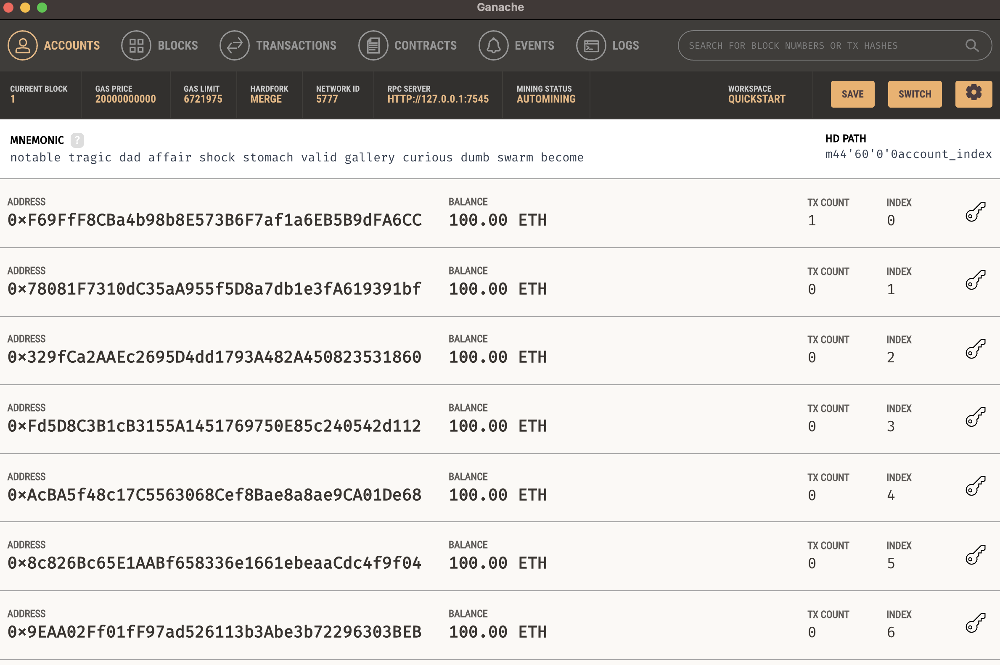

[toc]

# CollisionRepair

Artifact for paper "COLLISIONREPAIR: First-Aid and Automated Patching for Storage Collision Vulnerabilities in Smart Contracts". This repository contains scripts and results for evaluating the smart contract patching. Detailed patching instructions can be found in `octopus/PATCHING.md`.

## Installation / Environment Setup

- Before proceeding, install the following tools:

  | Tool              | Purpose                                     |
  | ----------------- | ------------------------------------------- |
  | Node.js ≥ v16     | For deploying contracts and running scripts |
  | Python >= 3.10.16 | For static verification and patching        |
  | Ganache           | Local Ethereum testnet (must be running)    |
  | Octopus           | Bytecode instrumentation engine             |

  ### Installation Steps

  **1.1 Install Node.js and npm**  
  Visit [https://nodejs.org/](https://nodejs.org/) or install via a package manager (e.g., `brew install node`)

  **1.2 Install Python dependencies**  

  **1.3 Install Ganache**

  Ganache is a local Ethereum testnet used for deploying and replaying contracts.

  - ✅ **Recommended: Ganache GUI**  
    1. Download the GUI from [https://trufflesuite.com/ganache/](https://trufflesuite.com/ganache/)  
    2. Launch it and click “Quickstart Ethereum”  
    3. Ensure it's running on `http://127.0.0.1:7545` (default)

    > The GUI makes it easy to view accounts, logs, and transactions interactively.

    
    
  - 🧪 **Alternative: Ganache CLI**  

    > You must keep Ganache running in the background while patching or replaying.

  **Important:** Ganache must be running at `http://127.0.0.1:7545` before applying patches or replaying transactions.

---

**2.1 Install Octopus from source**  

Our patching tool is built upon a modified Octopus(https://github.com/FuzzingLabs/octopus)

```bash
cd octopus
sudo python3 setup.py install
cd -
```

or

```
cd octopus
pip install -r requirements.txt
cd -
```


**2.2 Install Node dependencies**

```bash
cd evaluation/correctness
npm install
cd -
```


### Directory Structure

```
evaluation/
  correctness/
    contracts.txt                # List of contract addresses to process
    results/                     # Main output directory for all contract results
      <contract_address>/        # Each contract has its own folder
        abi.json                 # ABI for the contract
        bytecode.txt             # Bytecode for the contract
        transactions.json        # Historical transactions for the contract
        replay_results.json      # Results of transaction replays
        ...                      # Other files (e.g., address.txt, name.txt)
    clean/                       # Subset of results with at least one valid replay
      <contract_address>/        # Same structure as results/
    checkpoints/                 # Checkpoint files for resuming batch jobs
      deploy_checkpoint.json     # Progress checkpoint for deployment script
    scripts/
      correctness/
        deploy_original_replay.js    # Main batch deployment and replay script
        deploy_patch_replay.js       # Batch deploy and replay for patched contracts
        find_clean_results.js        # Script to filter and copy clean results
    patch.sh                    # Script to patch contracts in correctness
```

#### Data, Scripts, and Core Function of Patching

- **Data**: The `contracts.txt` file lists all contract addresses to be processed. The `results/` directory stores all output data for each contract, including ABI, bytecode, transactions, and replay results.

- **Scripts**: All main scripts are in `evaluation/correctness/scripts/correctness/`. These include deployment, replay, patching, and result filtering scripts.

- **Core Patch Function**: The `patch.sh` script is provided to patch contracts in the correctness dataset. Run it from the root or the `evaluation/correctness` directory to apply automated patching to all contracts listed in `contracts.txt`.


## Verifying Existing Results

Before verification, note that the results being verified are generated by scripts described in the following two sections: **Applying the Patch Tool** and **Regenerating Dynamic Execution Results**.

We provide two methods to verify the integrity and effectiveness of our patching process:

1. **Patched Bytecode Verification** — Confirms that the instrumented contracts are valid and that all `SSTORE` opcodes have been correctly patched.
2. **Transaction Replay Verification** — Compares transaction outcomes before and after patching to determine whether patched contracts preserve original behavior and fix the intended vulnerabilities.

If you wish to apply the patch and regenerate patched bytecode and replay results, please refer to the next two sections for detailed instructions.

### 1. Verifying Patched Bytecode

- **Script**: 

  - `verify_patch.sh`
  - `evaluation/scripts/verify_instrumentation.py`: This script takes a folder as input and automatically checks the original and patched bytecode, then displays the results.

- **Usage**:

  ```bash
  chmod 777 verify_patch.sh
  ./verify_patch.sh
  ```
- **Expected output (example):**

  ```
  Verification complete. Report saved to evaluation/correctness/results/instrumentation_verification.json
  Total contracts: 4097
  Valid contracts: 4097
  Invalid contracts: 0
  Error contracts: 0
  
  SSTORE Statistics:
  Total SSTORE instructions: 115581
  Valid SSTORE instrumentations: 115581
  Invalid SSTORE instrumentations: 0
  ```
- **Performance**: This static verification takes less than 1 minute to complete.


### 2. Verifying Existing Transaction Replay

- **Scripts**
  - `verify_tx.sh`
  - `evaluation/scripts/correctness/compare_results.js`: This script replays transactions and compares the results of the original and patched contracts to detect discrepancies.
- **How to use:**

```bash
chmod 777 verify_tx.sh
./verify_tx.sh
```

- **Expected output (example):**

```bash
./verify_tx.sh

Transaction Summary:
==================
Total Transactions: 392136
Successful Transactions: 365360
Failed Transactions: 26776
Transaction Success Rate: 93.17%

Detailed results saved to: CollisionRepair/evaluation/correctness/results/comparison_results.json
```

- **Performance**: This static verification takes less than 1 minute to complete.


## 3. Applying the Patch Tool

First, back up the existing `results/` directory to preserve previous outputs before generating new results.

```bash
cp -r evaluation/correctness/results evaluation/correctness/results_backup
```


### 3.1 Deploy the StorageTracker Contract

The `StorageTracker` contract is a helper component used to **check for storage collisions** during local execution. It monitors storage access patterns to ensure patched contracts do not overwrite or conflict with existing storage slots.


**Ganache must be running at `http://127.0.0.1:7545`**.

- Example: Running Ganache via the GUI Interface


- This step deploys a monitoring contract and saves the monitor address to be used during patching.

```bash
node js_scripts/monitor/deploy_monitor.js
```

- Example Output:

```bash
 node js_scripts/monitor/deploy_monitor.js
Using account: 0xF69FfF8CBa4b98b8E573B6F7af1a6EB5B9dFA6CC
Deploying Monitor contract...
Estimated gas: 1153299n
Monitor contract deployed at: 0xfaD68b67f6094211AB931a8dF5324aed0D6b319a
Updating config.json...
Done!
```


### 3.2 Run the Patching Script

After deploying the `StorageTracker` contract, the next step is to apply the patching process to all contracts listed in the dataset. This script instruments the bytecode to fix storage collisions using our trampoline-based approach.

```bash
chmod 777 patch.sh
./patch.sh
```

This script will:
- Load addresses from `evaluation/correctness/contracts.txt`
- Instrument contract bytecode using customized Octopus
- Save results under `evaluation/correctness/results/<contract_address>/`

- Example Output:

```bash
INFO - [+] Runtime code detected
INFO - [+] Runtime code detected
INFO - [+] Runtime code detected
INFO - [+] Runtime code detected
INFO - [+] Runtime code detected
WARNING - function signatures collision: ['symbol()', 'link_classic_internal(uint64,int64)']
WARNING - function signatures collision: ['ideal_warn_timed(uint256,uint128)', 'owner()']
WARNING - function signatures collision: ['decimals()', 'available_assert_time(uint16,uint64)']
INFO - [+] Runtime code detected
INFO - [+] Runtime code detected
...
```

---

- **Performance**: Patching 4,000 contracts takes approximately 2 to 4 hours, depending on the hardware.

## 4. Regenerating Dynamic Execution Results(Optional)

**If you want to re-run the transaction replays, you can execute the following scripts. Note that these scripts run in real time, so the replay results may vary slightly from previous runs.**

Checkpoint files are used to resume progress when replaying transactions for both the original and patched contracts. These checkpoints are located in the `evaluation/correctness/checkpoints/` directory.
 If you wish to start from scratch, simply delete the corresponding checkpoint files.

### 4.1 Start Ganache

Ganache must be running at `http://127.0.0.1:7545`.

### 4.2 Run Replay Scripts

```bash
node evaluation/scripts/correctness/deploy_original_replay.js
node evaluation/scripts/correctness/deploy_patch_replay.js
node evaluation/scripts/correctness/compare_results.js
```

- **What it does**: These scripts deploy each contract and replay its historical transactions on a local testnet, saving the results in `evaluation/correctness/results/`.

- **Performance**: Each deploy script can take approximately 4 to 6 hours to process all contracts, depending on your hardware and the size of the dataset. It is recommended to run these commands step by step for better control and monitoring.

---

## 5. Notes

- Octopus is required for both patching and static verification.
- Ganache is required to deploy the StorageTracker(monitor) contract and replay transactions.
- `compare_results.js` can be run independently to check replay consistency.
